<picture>
  <source media="(prefers-color-scheme: dark)" srcset="profile/banner-dark.svg">
  <source media="(prefers-color-scheme: light)" srcset="profile/banner-light.svg">
  
</picture>

# Yoshio Nomura

**Backend and AI-infrastructure engineering** — routing, retrieval, and gating expensive compute behind cheap fast paths.

Bachelor of Artificial Intelligence, University of Technology Sydney (expected 2028, GPA 3.7/4.0) · Backend AI Engineer — Internship (Remote) at FlyRank AI since July 2026 · Ho Chi Minh City

The thread through my projects: put a cheap, fast decision in front of an expensive, slow one. In **Pulsemind** (team), an XGBoost classifier's forward pass scores an ICU stream event in under 5 ms, and only anomalies go on to an LLM call. In **Develarper** (team of four), a local Qwen 2.5 3B model reads each task's difficulty and routes it before a cloud API is touched.

[Portfolio](https://yoshio-nomura.vercel.app) · [LinkedIn](https://www.linkedin.com/in/yoshio-nomura-b3219438b) · [X](https://x.com/Asterios07)

## Selected work

### Develarper — LLM task router

A two-tier router built by team Develarper for the AMD Developer Hackathon (Act II). A local Qwen 2.5 3B model scores each task's difficulty; hard tasks go to a cloud model on Fireworks and easy ones stay local.

- **18 of 19** tasks routed to the correct tier, on a 19-task harness with self-defined labels.
- **~80% of tasks** ran on the local model — a count of tasks, not tokens.
- **93.00%** (186/200) answer quality over 100 factual and 100 summarization tasks, scored by similarity and Jaccard overlap against expected answers rather than human or LLM review. 6 of the 200 prompts contain unrendered template placeholders.
- **505.1 ms** mean latency per task, across 200 sequential tasks.

Team of 4 — LLMOps · July 2026 · AMD Developer Hackathon, Act II · Python · Qwen 2.5 3B via Ollama · FastAPI · Fireworks 
[Repository →](https://github.com/UniverseScripts/develarper)

### Pulsemind — critical-care telemetry

An asynchronous ICU telemetry processor. An XGBoost classifier, selected in a bake-off against LightGBM and CatBoost over 109 ventilator, comorbidity and treatment features, scores incoming stream events and gates higher-cost LLM rationalisation so it fires only on detected anomalies.

- **< 5 ms** classifier forward pass per stream event.
- **< 50 ms** end to end; the anomaly path adds the LLM rationalisation step, roughly 15 seconds.

Trained on the credentialed MIMIC-IV (PhysioNet) de-identified ICU dataset under its data use agreement; demonstrations run on a synthetic derivative. No clinical deployment.

Team — full-stack AI engineer · May 2026 – ongoing · Python · XGBoost · PyTorch · scikit-learn · React 
[UI prototype →](https://pulsemind-ai-woad.vercel.app)

### Roomie — roommate and apartment matching

Built with team Hackaphobia at the GDGoC National Hackathon 2026 in Hanoi, where the team received a Top 30 Finalist Award. An onboarding survey and swipe interface: seven survey answers are encoded into a vector and scored against candidates by cosine similarity, with an optional free-text bio path through Vertex AI embeddings. Stateful WebSocket chat reaches every session a user has open.

- **~50** real users onboarded and swiped at demo day.
- **~12 ms** average request latency on the structured matching path, excluding embedding generation.

Contributor, team of 4 — DevOps & Backend Engineering · April 2026 · Python 3.11 · FastAPI on Cloud Run · Cloud Firestore · Firebase Auth · Vertex AI · React 19 · Leaflet · Docker · GitHub Actions 
[Repository →](https://github.com/UniverseScripts/gdgoc-hackaphobia-roomie) · [Demo →](https://hackaphobia-roomie.web.app/)

## More projects

- **[Weatherise](https://github.com/UniverseScripts/weatherise-ai)** — a weather-intelligence pipeline: REST sources and NVIDIA Earth-2 surrogate models feed a multi-agent chain on Nemotron Ultra using MCP, with a Qdrant vector database for retrieval-augmented generation. Team — LLMOps & Backend AI Engineering · 9–11 June 2026 · Vietnam AI Open Hackathon (NVIDIA / OpenACC) · Python · Qdrant · Earth-2 · Nemotron Ultra · MCP
- **[Vora](https://devcamp2-frontend.vercel.app)** — a quiz-verified learning roadmap. The backend resolver turns unstructured model output into validated, dependency-mapped directed acyclic graphs and checks prerequisite order. [Backend repository](https://github.com/PTAxHVA/devcamp2-backend). Team — backend engineer · April 2026 · GDGoC DevCamp, HCMUT · Express 5 · MongoDB · Zod · Fireworks · React 19 · React Flow
- **[llmops](https://github.com/UniverseScripts/llmops)** — a self-hosted inference node on one machine: flan-t5-base in 8-bit with a LoRA adapter behind FastAPI, with PostgreSQL, Redis rate limiting, Traefik, a Cloudflare tunnel, and Prometheus and Grafana, all on Docker Compose. Solo · March 2026 · Python · FastAPI · PostgreSQL · Redis · Traefik · Prometheus · Grafana · Docker Compose
- **[ArchitectureLab](https://architecturelab.vercel.app)** — a person and an agent inspect the same live system model; the agent calls tools the page registers through WebMCP and can only propose changes that a human applies. [Repository](https://github.com/UniverseScripts/webmcp). Team of 3 — scaffold, WebMCP adapter, deployment · September 2026 · OpenAI WebMCP Challenge · React 19 · Vite · TypeScript · Playwright
- **[Local RAG API](https://github.com/UniverseScripts/local-rag-api)** — a local-first RAG backend: ingest PDF or TXT, then chat over it. Chunks are embedded with all-MiniLM-L6-v2 into ChromaDB and answered through Ollama, and every chat response returns its sources and inference time. Solo · February 2026 · Python · FastAPI · ChromaDB · sentence-transformers · Ollama · MIT
- **[agentrisk-daas](https://github.com/UniverseScripts/agentrisk-daas)** — a risk-data service for the AI-agent package supply chain (MCP, npm, PyPI): a scraper on a six-hourly cron feeds a FastAPI, PostgreSQL and Redis API on Render, with a static Next.js front end. [Site](https://agentrisk-daas-asteriostech-projects.vercel.app). Solo · March–August 2026 · Python · FastAPI · SQLAlchemy · Alembic · PostgreSQL · Redis · Next.js · Render

## Skills

- **Languages** — Python · TypeScript · SQL · Java
- **Backend** — FastAPI · REST APIs · WebSockets · async patterns · Cloud Firestore · PostgreSQL · Redis · SQLAlchemy / Alembic · Traefik
- **AI infrastructure** — XGBoost · PyTorch · scikit-learn · local LLM serving with Ollama · Vertex AI embeddings · Qdrant and RAG · multi-agent chains on Nemotron Ultra · NVIDIA Earth-2 surrogates · MCP
- **Frontend** — React 19 · Next.js 15 (App Router) · Tailwind v4
- **Tooling** — Git · GitHub Actions · Docker and Docker Compose · Prometheus and Grafana · Vercel

## Activity

  <picture>
    <source media="(prefers-color-scheme: dark)" srcset="profile/stats-dark.svg">
    <source media="(prefers-color-scheme: light)" srcset="profile/stats-light.svg">
    
  </picture>
  <picture>
    <source media="(prefers-color-scheme: dark)" srcset="profile/top-langs-dark.svg">
    <source media="(prefers-color-scheme: light)" srcset="profile/top-langs-light.svg">
    
  </picture>

  <picture>
    <source media="(prefers-color-scheme: dark)" srcset="https://streak-stats.demolab.com?user=UniverseScripts&amp;disable_animations=true&amp;hide_border=true&amp;background=FFFFFF00&amp;ring=4493F8&amp;fire=D29922&amp;currStreakNum=F0F6FC&amp;sideNums=F0F6FC&amp;currStreakLabel=4493F8&amp;sideLabels=9198A1&amp;dates=9198A1&amp;stroke=3D444D">
    <source media="(prefers-color-scheme: light)" srcset="https://streak-stats.demolab.com?user=UniverseScripts&amp;disable_animations=true&amp;hide_border=true&amp;background=FFFFFF00&amp;ring=0969DA&amp;fire=9A6700&amp;currStreakNum=1F2328&amp;sideNums=1F2328&amp;currStreakLabel=0969DA&amp;sideLabels=59636E&amp;dates=59636E&amp;stroke=D1D9E0">
    
  </picture>

<picture>
  <source media="(prefers-color-scheme: dark)" srcset="profile/snake-dark.svg">
  <source media="(prefers-color-scheme: light)" srcset="profile/snake-light.svg">
  
</picture>

Regenerated daily by a GitHub Action in this repository. Top languages counts bytes of code in public, non-fork repositories.

## Credentials

| Credential | Issuer | Issued |
| :--- | :--- | :--- |
| Dean's List 2026 | University of Technology Sydney | 2026-07-09 |
| Selected to compete, one of 10 teams from ~100 registrants · Certificate of Attendance | Vietnam AI Open Hackathon (NVIDIA / OpenACC) | 2026-06-09 |
| Top 30 Finalist Award · team Hackaphobia | GDGoC National Hackathon 2026, Hanoi | 2026-05-20 |
| Next.js App Router Fundamentals | Vercel | 2026-02-20 |
| Generative AI with Large Language Models | DeepLearning.AI & AWS, via Coursera | 2026-01-02 |
| AWS Cloud Practitioner Essentials | Amazon Web Services | 2025-12-03 |

## Kits

- **[Local RAG API starter kit](https://asteriostech.gumroad.com/l/local-rag-api)** — the paid companion to the open-source [local-rag-api](https://github.com/UniverseScripts/local-rag-api) core described above.
- **[Next.js Mobile Starter Kit](https://asteriostech.gumroad.com/l/nextjs-mobile-marketplace)** — built on the open-source [nextjs-marketplace-free](https://github.com/UniverseScripts/nextjs-marketplace-free) UI: Next.js 16 and React 19, a hand-rolled touch swipe deck, a 7-step onboarding wizard, per-user localStorage persistence and Radix-based primitives.

## Elsewhere

[Portfolio](https://yoshio-nomura.vercel.app) · [LinkedIn](https://www.linkedin.com/in/yoshio-nomura-b3219438b) · [X](https://x.com/Asterios07) · [YouTube](https://www.youtube.com/@AsteriosTech) · [TikTok](https://www.tiktok.com/@asteriostech) · [Instagram](https://www.instagram.com/asteriostech/)
